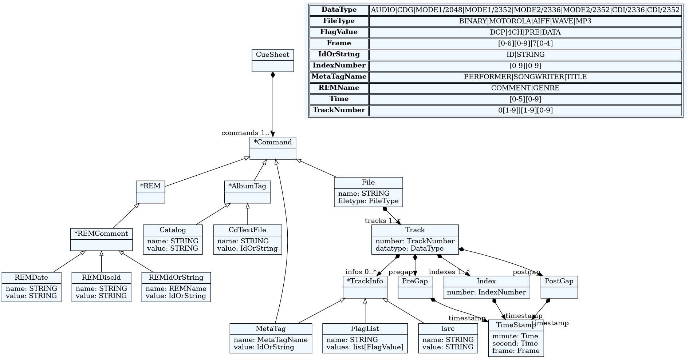
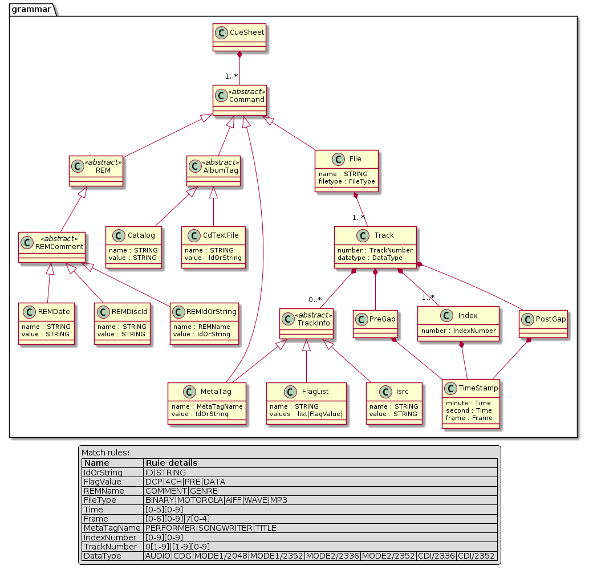

=====
Coupe
=====

-----------------------------------------------------------------
Simple but accurate multi-purpose Cue-Sheet parser based on textX
-----------------------------------------------------------------

.. contents:: Table of Contents

Description
===========

`coupe`_ is a parser for `cue-sheet`_ files, as described in `Appendix A of CDRWIN
user manual`_.

It makes use of `textX`_, a meta-language for building Domain-Specific Languages
or specific file format parsers in `Python`_.

It's free as in `free beer` and distributed under `GNU General Public License v3+`_.

Installation
============

.. code:: bash

  $ pip install coupe

Graphical representation
========================

Meta-model
----------

Graphical visualization of coupe_ meta-model in `GraphViz`_'s dot format

.. note:: ``dot -> png`` conversion requires `GraphViz`_

.. code:: bash

    $ textx generate grammar.tx --target dot
    $ dot -Tpng -O grammar.dot

Graphical visualization of coupe_ meta-model in `PlantUML`_'s pu format

.. note:: ``pu -> png`` conversion requires `PlantUML`_

.. code:: bash

    $ textx generate grammar.tx --target PlantUML
    $ plantuml grammar.pu

Model
-----

Simple example from `Cue sheet page`_ on the `Hydrogenaudio Knowledgebase web site`_:

.. code:: bash

    $ cat test1.cue

.. code::

    REM GENRE Alternative
    REM DATE 1991
    REM DISCID 860B640B
    REM COMMENT "ExactAudioCopy v0.95b4"
    PERFORMER "My Bloody Valentine"
    TITLE "Loveless"
    FILE "My Bloody Valentine - Loveless.wav" WAVE
        TRACK 01 AUDIO
            TITLE "Only Shallow"
            PERFORMER "My Bloody Valentine"
            INDEX 01 00:00:00
            TRACK 02 AUDIO
            TITLE "Loomer"
            PERFORMER "My Bloody Valentine"
            INDEX 01 04:17:52

Graphical visualization of test1.cue in `GraphViz`_'s dot format

.. note:: ``dot -> png`` conversion requires `GraphViz`_

.. code:: bash

    $ textx generate test1.cue --grammar grammar.tx --target dot
    $ dot -Tpng -O test1.dot

.. image:: images/test1-graphviz.png
    :width: 600px
    :alt: Meta-model in GraphViz format

Usage
=====

Let's re-use our previous example.

.. code:: bash

    $ prout

.. _cue-sheet: https://en.wikipedia.org/wiki/Cue_sheet_(computing)
.. _Appendix A of CDRWIN user manual: https://web.archive.org/web/20070614044112/http://www.goldenhawk.com/download/cdrwin.pdf
.. _textX: https://github.com/textX/textX
.. _Python: https://www.python.org/
.. _GNU General Public License v3+: https://www.gnu.org/licenses/gpl-3.0.en.html
.. _GraphViz: https://www.graphviz.org/
.. _PlantUML: https://plantuml.com/
.. _Cue sheet page: http://wiki.hydrogenaud.io/index.php?title=Cue_sheet
.. _Hydrogenaudio Knowledgebase web site: http://wiki.hydrogenaud.io/index.php
